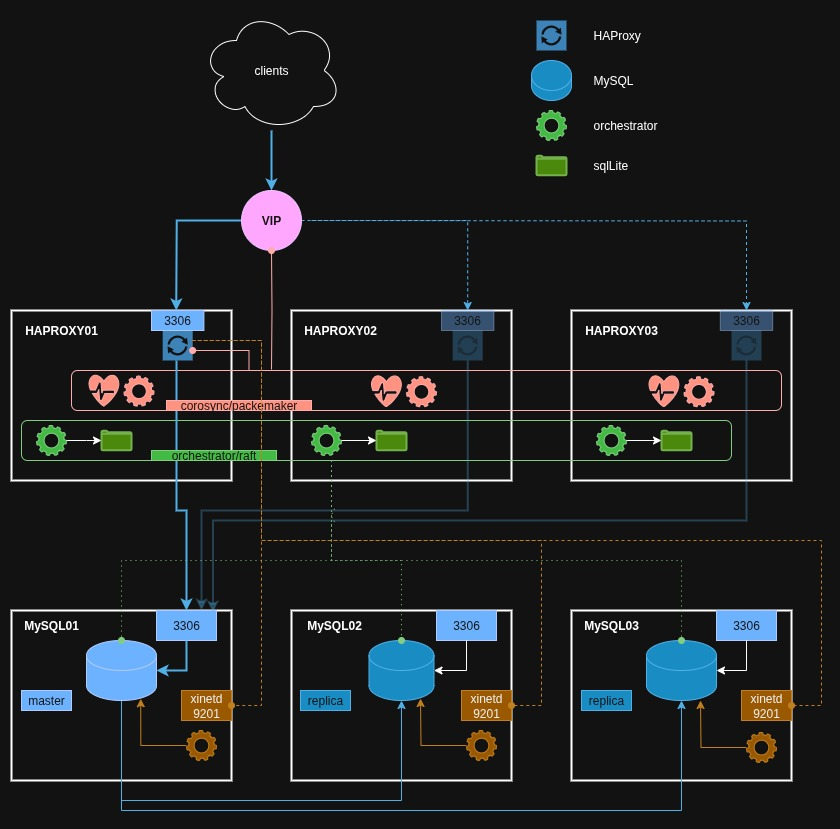

# MySQL-HA
mysql ha setup with haproxy/orchestrator/mariadb on debian12

## Overview




## Prereq

Setup 6 nodes with Debian12 - 3X mysql and 3X haproxy.

And update them:

```apt update; apt upgrade -y; reboot```


Before start for simplicity add keys so you can login to each node without password.

ssh-keygen -t ed25599

### Configure /etc/hosts on all nodes

```/etc/hosts```

```
192.168.1.201 haproxy01
192.168.1.202 haproxy02
192.168.1.203 haproxy03
192.168.1.211 mysql01
192.168.1.212 mysql02
192.168.1.213 mysql03
```

## MySQL setup

### install mariadb

```apt install mariadb-server mariadb-backup -y```

and run 

```mysql_secure_installation```

### configure mariadb

```/etc/mysql/mariadb.conf.d/50-server.cnf```

for node mysql01 will looks like that

```
[server]

[mysqld]

report_host = 192.168.69.211
read_only = 1

log-bin			= /var/log/mysql/mysql01-dev-bin
binlog_format = row
server-id              = 211

log_slave_updates
pid-file                = /run/mysqld/mysqld.pid
basedir                 = /usr

bind-address            = 0.0.0.0
expire_logs_days        = 10

character-set-server  = utf8mb4
collation-server      = utf8mb4_general_ci

[embedded]

[mariadb]

[mariadb-10.11]
```
### add users to mysql 

replication user and privileges:

```CREATE USER 'repl'@'192.168.1.%' IDENTIFIED BY 'test123';```

```GRANT REPLICATION SLAVE ON *.* TO `repl`@`%`;```

orchestrator user and privileges:

```
CREATE USER 'orchestrator'@'192.168.1.201' IDENTIFIED BY 'orch123';
CREATE USER 'orchestrator'@'192.168.1.202' IDENTIFIED BY 'orch123';
CREATE USER 'orchestrator'@'192.168.1.203' IDENTIFIED BY 'orch123';
```

```
GRANT ALL ON *.* TO 'orchestrator'@'192.168.1.201';
GRANT ALL ON *.* TO 'orchestrator'@'192.168.1.201';
GRANT ALL ON *.* TO 'orchestrator'@'192.168.1.201';
```

setup table with replication credentials for orchestrator:

```
CREATE TABLE `orch_meta` (
  `id` bigint(20) NOT NULL AUTO_INCREMENT,
  `repl_user` varchar(128) DEFAULT NULL,
  `repl_pass` varchar(128) DEFAULT NULL,
  PRIMARY KEY (`id`)
) ENGINE=InnoDB AUTO_INCREMENT=3 DEFAULT CHARSET=latin1 COLLATE=latin1_swedish_ci
```

and populate table with replication user/password

```
insert into orch_meta ( repl_user, repl_pass) values ( 'repl', 'test123');
```
create database meta

```create database meta;```

create table cluster inside database meta for cluster name

```
CREATE TABLE `cluster` (
  `anchor` tinyint(4) NOT NULL,
  `cluster_name` varchar(128) CHARACTER SET ascii COLLATE ascii_general_ci NOT NULL DEFAULT '',
  `cluster_domain` varchar(128) CHARACTER SET ascii COLLATE ascii_general_ci NOT NULL DEFAULT '',
  PRIMARY KEY (`anchor`)
) ENGINE=InnoDB DEFAULT CHARSET=utf8mb3 COLLATE=utf8mb3_general_ci
```

insert cluster name

```
INSERT INTO meta.cluster (anchor, cluster_name, cluster_domain) VALUES (1, 'sqltestcluster', 'testdomain.com');
```

### setup slaves

create script ```/usr/local/sbin/setup_slave.sh```

```
#!/bin/bash

SLAVE=${1}

: "${SLAVE:?SLAVE not specified. example run: ./setup_slave.sh [SLAVE]}"

read -s -p "Enter password for repl user: " password

read -p "You about to setup ${SLAVE} as replica to current server. Do you want to continue? (y/n): " answer
case "$answer" in
    [Yy]* ) 
        echo "Continuing...";;
    [Nn]* ) 
        echo "Exiting script."; 
        exit 1;;
    * ) 
        echo "Invalid input. Please answer y or n."; 
        exit 1;;
esac

rm -rf /backup/*
mariabackup --backup --slave-info --safe-slave-backup --target-dir=/backup
scp -r /backup mysql01-dev:/
ssh ${SLAVE} "systemctl stop mysqld ; rm -rf /var/log/mysql/* ; rm -rf /var/lib/mysql/* ; mariabackup --prepare --target-dir=/backup ; cp -r /backup/* /var/lib/mysql/ ; chown -R mysql:mysql /var/lib/mysql ; systemctl restart mysqld"

mysql -h ${SLAVE} -N -se "CHANGE MASTER TO MASTER_HOST='`hostname -s`', MASTER_USER='repl', MASTER_PASSWORD='`${password}`', MASTER_PORT=3306, MASTER_CONNECT_RETRY=10, master_use_gtid=slave_pos; start slave;"
```

setup replica on mysql02 and mysql03 simply running 

```
/usr/local/sbin/setup_slave.sh mysql02
/usr/local/sbin/setup_slave.sh mysql03
```

## haproxy

follow link to install haproxy https://haproxy.debian.net/#distribution=Debian&release=bookworm&version=3.2

```
curl https://haproxy.debian.net/haproxy-archive-keyring.gpg > /usr/share/keyrings/haproxy-archive-keyring.gpg
echo deb "[signed-by=/usr/share/keyrings/haproxy-archive-keyring.gpg]" http://haproxy.debian.net bookworm-backports-3.2 main > /etc/apt/sources.list.d/haproxy.list
apt-get update
apt-get install haproxy=3.2.\*
```

create haproxy config

```
global
    log /dev/log local0
    maxconn 15000
    daemon
    stats socket /var/run/haproxy.sock mode 600 level admin
    user haproxy
    group haproxy

defaults
    log global
    mode tcp
    timeout connect 10s
    timeout client 1m
    timeout server 1m
    option tcpka

frontend mysql-write
    bind *:3306
    default_backend mysql-master

backend mysql-master
    mode tcp
    option httpchk

    server mysql01-dev 192.168.1.211:3306 check port 9201
    server mysql02-dev 192.168.1.212:3306 check port 9201
    server mysql03-dev 192.168.1.213:3306 check port 9201

listen stats # Define a listen section called "stats"
	bind 0.0.0.0:9000 # Listen on localhost:9000
	mode http
	stats enable  # Enable stats page
	stats refresh 2s
	stats hide-version  # Hide HAProxy version
	stats realm Haproxy\ Statistics  # Title text for popup window
	stats uri /haproxy_stats  # Stats URI
	stats auth admin:test123456  # Authentication credentials
	stats admin if TRUE
```

disable and stop haproxy for now

```systemctl disable --now haproxy```

copy confg to all haproxy nodes

```
scp /etc/haproxy.haproxy.cfg haproxy02:/etc/haproxy/ ; ssh haproxy02 "`systemctl disable --now haproxy"
scp /etc/haproxy.haproxy.cfg haproxy03:/etc/haproxy/ ; ssh haproxy03 "`systemctl disable --now haproxy"
```

## corosync/packemaker

### install

```apt install corosync crmsh pacemaker pcs pacemaker-resource-agents```

### configuration


```
totem {
  version: 2
  cluster_name: haproxy
  transport: udpu
  interface {
    ringnumber: 0
    broadcast: yes
    mcastport: 5405
  }
}

quorum {
  provider: corosync_votequorum
  two_node: 1
}

nodelist {

 		node {
                        ring0_addr: 192.168.1.201
                        name: haproxy01
 			nodeid: 1

		}
 		node {
                        ring0_addr: 192.168.1.202
                        name: haproxy02
 			nodeid: 2

		}
 		node {
                        ring0_addr: 192.168.1.203
                        name: haproxy03
 			nodeid: 3

		}
 
}

logging {
  to_logfile: yes
  logfile: /var/log/corosync/corosync.log
  to_syslog: yes
  timestamp: on
}

```

resources config

```
crm configure property stonith-enabled=false
crm configure property no-quorum-policy=ignore
crm configure primitive vip-haproxy ocf:heartbeat:IPaddr2 params ip='192.168.1.200' nic=ens192 cidr_netmask='32' op monitor interval='5s' meta migration-threshold='10'
crm resource start vip-haproxy
pcs constraint location vip-haproxy prefers haproxy01=100
resource create srv-haproxy systemd:haproxy
pcs constraint colocation add vip-haproxy with srv-haproxy INFINITY
```

### xinetd on mysql servers

```apt install xinetd -y```

configure:

```/etc/xinetd.d/readonlycheck```

```
service readonlycheck

{
    flags = REUSE
    disable         = no
    socket_type     = stream
    protocol        = tcp
    wait            = no
    user            = mysql
    server          = /usr/local/bin/readonlycheck.sh
    port            = 9201
    type            = UNLISTED
    only_from       = 127.0.0.1 192.168.1.0/24
    log_on_failure  += USERID
}
```

script ```/usr/local/bin/readonlycheck.sh```

```
#!/bin/bash

function RO_OFF(){
/bin/echo -e "HTTP/1.1 200 OK\r\n"
/bin/echo -e "Content-Type: Content-Type: text/plain\r\n"
/bin/echo -e "\r\n"
/bin/echo -e "MySQL is running.\r\n"
/bin/echo -e "\r\n"
}

function RO_ON(){
/bin/echo -e "HTTP/1.1 503 Service Unavailable\r\n"
/bin/echo -e "Content-Type: Content-Type: text/plain\r\n"
/bin/echo -e "\r\n"
/bin/echo -e "MySQL is running.\r\n"
/bin/echo -e "\r\n"
}

READ_ONLY=`mysql -N -se "SHOW GLOBAL VARIABLES LIKE 'read_only';" | awk '{print $2}'`

if [ "${READ_ONLY}" != "OFF" ]; then
	RO_ON
else
       	RO_OFF
fi

```
restart and enable xinetd:

```systemctl restart --now xinetd```


## orchestrator install on haproxy servers

download orchestrator:

```
wget wget https://github.com/openark/orchestrator/releases/download/v3.2.6/orchestrator-3.2.6-linux-amd64.tar.gz
tar zxvf orchestrator-3.2.6-linux-amd64.tar.gz -C /
ln -s /usr/local/orchestrator/resources/bin/orchestrator-client /usr/bin/
systemctl daemon-reload
```

create orchestrator config file ```/etc/orchestrator.conf.json```

```
{
  "Debug": true,
  "EnableSyslog": false,
  "ListenAddress": ":3000",
  "MySQLTopologyUser": "orchestrator",
  "MySQLTopologyPassword": "orch123",
  "MySQLTopologyCredentialsConfigFile": "",
  "MySQLTopologySSLPrivateKeyFile": "",
  "MySQLTopologySSLCertFile": "",
  "MySQLTopologySSLCAFile": "",
  "MySQLTopologySSLSkipVerify": true,
  "MySQLTopologyUseMutualTLS": false,
  "BackendDB": "sqlite",
  "SQLite3DataFile": "/usr/local/orchestrator/orchestrator.sqlite3",
  "MySQLConnectTimeoutSeconds": 1,
  "DefaultInstancePort": 3307,
  "DiscoverByShowSlaveHosts": true,
  "InstancePollSeconds": 5,
  "RecoveryPollSeconds": 10,
  "ReplicationCredentialsQuery": "select repl_user, repl_pass from mysql.orch_meta;", 
  "DiscoveryIgnoreReplicaHostnameFilters": [
    "a_host_i_want_to_ignore[.]example[.]com",
    ".*[.]ignore_all_hosts_from_this_domain[.]example[.]com",
    "a_host_with_extra_port_i_want_to_ignore[.]example[.]com:3307"
  ],
  "RaftEnabled": true,
  "RaftDataDir": "/var/lib/orchestrator",
  "RaftBind": "192.168.1.20",
  "DefaultRaftPort": 10008,
  "RaftNodes": [
    "192.168.1.201",
    "192.168.1.202",
    "192.168.1.203"
  ],
  "WebRefreshSeconds": 10,
  "UnseenInstanceForgetHours": 240,
  "SnapshotTopologiesIntervalHours": 0,
  "InstanceBulkOperationsWaitTimeoutSeconds": 10,
  "HostnameResolveMethod": "none",
  "MySQLHostnameResolveMethod": "@@report_host",
  "SkipBinlogServerUnresolveCheck": true,
  "ExpiryHostnameResolvesMinutes": 60,
  "RejectHostnameResolvePattern": "",
  "ReasonableReplicationLagSeconds": 10,
  "ProblemIgnoreHostnameFilters": [],
  "VerifyReplicationFilters": false,
  "ReasonableMaintenanceReplicationLagSeconds": 20,
  "CandidateInstanceExpireMinutes": 60,
  "AuditLogFile": "",
  "AuditToSyslog": false,
  "RemoveTextFromHostnameDisplay": ".mydomain.com:3306",
  "ReadOnly": false,
  "AuthenticationMethod": "",
  "HTTPAuthUser": "",
  "HTTPAuthPassword": "",
  "AuthUserHeader": "",
  "PowerAuthUsers": [
    "*"
  ],
    "ClusterNameToAlias": {
    "127.0.0.1": "test suite"
  },
    "Hooks": {
    "OnMasterFailoverScript": "/usr/local/bin/update-haproxy-master.sh {{.NewMasterHostname}}"
  },
  "ReplicationLagQuery": "",
  "DetectClusterAliasQuery": "SELECT ifnull(max(cluster_name), '''') as cluster_alias from meta.cluster where anchor=1;",
  "DetectClusterDomainQuery": "SELECT ifnull(max(cluster_name), '''') as cluster_alias from meta.cluster where anchor=1;",
  "DetectInstanceAliasQuery": "",
  "DetectPromotionRuleQuery": "",
  "DataCenterPattern": "[.]([^.]+)[.][^.]+[.]mydomain[.]com",
  "PhysicalEnvironmentPattern": "[.]([^.]+[.][^.]+)[.]mydomain[.]com",
  "PromotionIgnoreHostnameFilters": [],
  "DetectSemiSyncEnforcedQuery": "",
  "ServeAgentsHttp": false,
  "AgentsServerPort": ":3001",
  "AgentsUseSSL": false,
  "AgentsUseMutualTLS": false,
  "AgentSSLSkipVerify": false,
  "AgentSSLPrivateKeyFile": "",
  "AgentSSLCertFile": "",
  "AgentSSLCAFile": "",
  "AgentSSLValidOUs": [],
  "UseSSL": false,
  "UseMutualTLS": false,
  "SSLSkipVerify": false,
  "SSLPrivateKeyFile": "",
  "SSLCertFile": "",
  "SSLCAFile": "",
  "SSLValidOUs": [],
  "URLPrefix": "",
  "StatusEndpoint": "/api/status",
  "StatusSimpleHealth": true,
  "StatusOUVerify": false,
  "AgentPollMinutes": 60,
  "UnseenAgentForgetHours": 6,
  "StaleSeedFailMinutes": 60,
  "SeedAcceptableBytesDiff": 8192,
  "PseudoGTIDPattern": "",
  "PseudoGTIDPatternIsFixedSubstring": false,
  "PseudoGTIDMonotonicHint": "asc:",
  "DetectPseudoGTIDQuery": "",
  "BinlogEventsChunkSize": 10000,
  "SkipBinlogEventsContaining": [],
  "ReduceReplicationAnalysisCount": true,
  "FailureDetectionPeriodBlockMinutes": 60,
  "FailMasterPromotionOnLagMinutes": 0,
  "AutoRecoverDeadSlaves": true,
  "RecoveryPeriodBlockSeconds": 3600,
  "AutoRecoverMaster": true,
  "AutoRecoverIntermediateMaster": true,
  "RecoveryIgnoreHostnameFilters": [],
  "RecoverMasterClusterFilters": ["*" ],
  "RecoverIntermediateMasterClusterFilters": ["*"],
  "AutoRecoverMasterCluster": true,
  "AutoRecoverIntermediateMasterCluster": true,
  "FailMasterWithSlaves": true,

  "OnFailureDetectionProcesses": [
    "echo 'Detected {failureType} on {failureCluster}. Affected replicas: {countSlaves}' >> /tmp/recovery.log"
  ],
  "PreGracefulTakeoverProcesses": [
    "echo 'Planned takeover about to take place on {failureCluster}. Master will switch to read_only' >> /tmp/recovery.log"
  ],
  "PreFailoverProcesses": [
    "echo 'Will recover from {failureType} on {failureCluster}' >> /tmp/recovery.log"
  ],
  "PostFailoverProcesses": [
    "echo '(for all types) Recovered from {failureType} on {failureCluster}. Failed: {failedHost}:{failedPort}; Successor: {successorHost}:{successorPort}' >> /tmp/recovery.log"
  ],
  "PostUnsuccessfulFailoverProcesses": [],
  "PostMasterFailoverProcesses": [
    "echo 'Recovered from {failureType} on {failureCluster}. Failed: {failedHost}:{failedPort}; Promoted: {successorHost}:{successorPort}' >> /tmp/recovery.log"
  ],
  "PostIntermediateMasterFailoverProcesses": [
    "echo 'Recovered from {failureType} on {failureCluster}. Failed: {failedHost}:{failedPort}; Successor: {successorHost}:{successorPort}' >> /tmp/recovery.log"
  ],
  "PostGracefulTakeoverProcesses": [
    "echo 'Planned takeover complete' >> /tmp/recovery.log"
  ],
  "CoMasterRecoveryMustPromoteOtherCoMaster": true,
  "DetachLostSlavesAfterMasterFailover": true,
  "ApplyMySQLPromotionAfterMasterFailover": true,
  "PreventCrossDataCenterMasterFailover": false,
  "PreventCrossRegionMasterFailover": false,
  "MasterFailoverDetachReplicaMasterHost": false,
  "MasterFailoverLostInstancesDowntimeMinutes": 0,
  "PostponeReplicaRecoveryOnLagMinutes": 0,
  "OSCIgnoreHostnameFilters": [],
  "GraphiteAddr": "",
  "GraphitePath": "",
  "GraphiteConvertHostnameDotsToUnderscores": true,
  "ConsulAddress": "",
  "ConsulAclToken": ""
}

```

start and enable orchestrator

```systemctl enable --now orchestrator```

copy same config to rest of the nodes, and change config config line to node ip address

```
  "RaftBind": "192.168.1.201",
```

at this point you should have orchestrator running with sqlite backend and raft clustering


